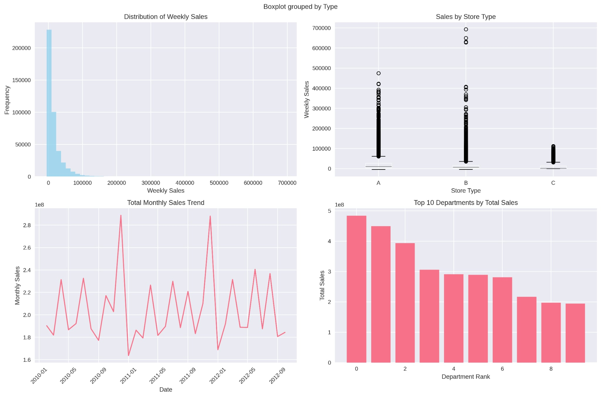
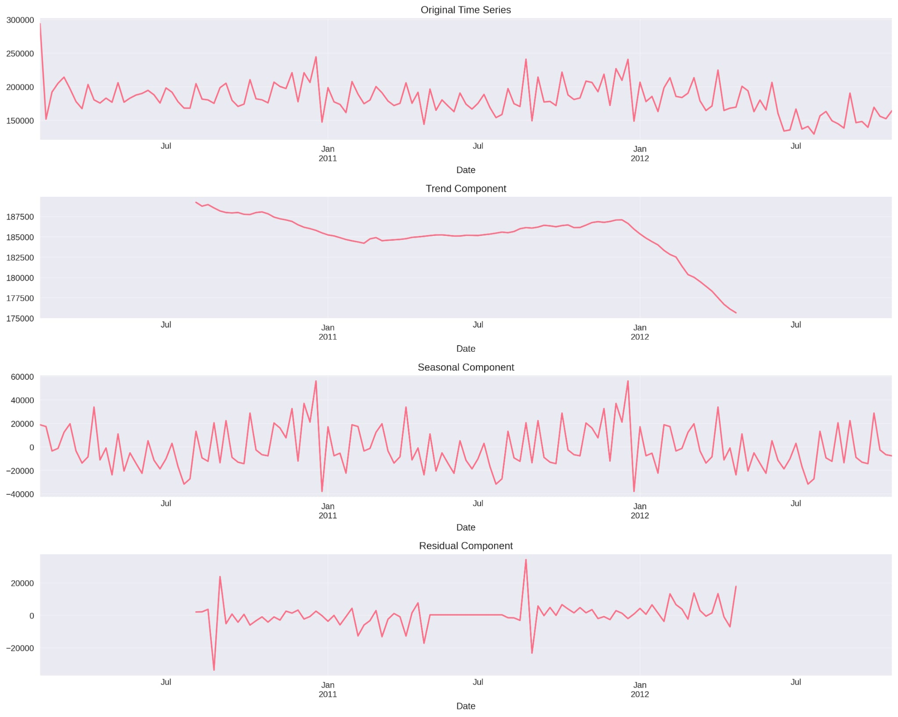
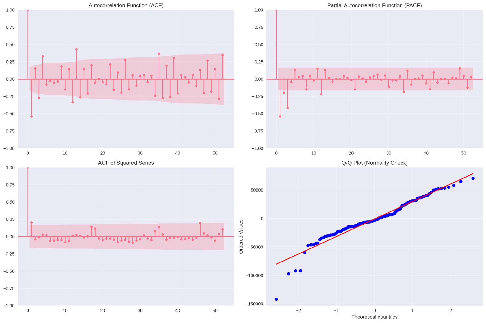

# 🛒 Walmart Sales Forecasting - სრული Machine Learning Journey

## 📋 **პროექტის მიმოხილვა**

ეს პროექტი წარმოადგენს სრულფასოვან machine learning-ის მიდგომას Walmart-ის გაყიდვების პროგნოზირებისთვის. განხორციელდა **რვა განსხვავებული მოდელის** შედარებითი ანალიზი და შემუშავება, რომლებიც მოიცავს ტრადიციულ სტატისტიკურ მეთოდებს, gradient boosting-ს და deep learning-ს. საბოლოო მიზანი იყო **Weighted Mean Absolute Error (WMAE)** მეტრიკის მინიმიზაცია, სადაც სადღესასწაულო კვირები 5x წონით ითვლება.

### 🎯 **საბოლოო შედეგები (WMAE Rankings):**
- 🥇 **N-BEATS Model**: **2,091.32** (ვალიდაცია) - **საუკეთესო შედეგი**
- 🥈 **XGBoost Model**: **2,637 WMAE** (ყველაზე სტაბილური baseline)
- 🥉 **Prophet Model**: **2,737.38 WMAE** (საუკეთესო ინტერპრეტაცია)
- 🏆 **LightGBM Model**: **3,557.90 WMAE** (სწრაფი ტრენინგი)
- 📊 **ARIMA Models**: **25-4,400+ WMAE** (დეპარტამენტების მიხედვით)
- ⚡ **DLinear Model**: **18k/17k WMAE** (experimental deep learning approach)

### 🔬 **გამოყენებული მიდგომები:**
1. **📈 Time Series Models**: ARIMA, Prophet
2. **🌳 Tree-Based Models**: XGBoost, LightGBM
3. **🧠 Deep Learning Models**: N-BEATS, DLinear

## 📊 **მონაცემთა ანალიზი და გამოწვევები**

### **მონაცემთა სტატისტიკა:**
```
📈 სწავლების მონაცემები: 421,570 ჩანაწერი
🧪 ტესტის მონაცემები: 115,064 პროგნოზი
🏪 მაღაზიები: 45 უნიკალური
🏷️ დეპარტამენტები: 81 უნიკალური
📅 დროის პერიოდი: 2010-2013 (143 კვირა)
💰 გაყიდვების დიაპაზონი: $-4,988 - $693,099
```


### **ძირითადი გამოწვევები:**
1. **სადღესასწაულო ეფექტები**: Christmas, Thanksgiving, Labor Day, Super Bowl
2. **სეზონური ვარიაციები**: 52-კვირიანი ციკლები
3. **მაღაზიების ჰეტეროგენურობა**: A, B, C ტიპები სხვადასხვა ზომით
4. **WMAE მეტრიკა**: სადღესასწაულო კვირების 5x წონა
5. **მონაცემთა ხარისხი**: NaN მნიშვნელობები, outlier-ები

---

## 🎯 **მოდელი 1: ARIMA - Time Series Foundation**

### **მიდგომის ევოლუცია:**

#### **🔄 ვერსია 1: ძირითადი იმპლემენტაცია**
```python
# პირველი მცდელობა - ფიქსირებული პარამეტრები
SARIMAX(order=(1,1,1), seasonal_order=(1,1,1,52))
```
**შედეგი:** სწავლა მიმდინარეობდა, მაგრამ ოპტიმიზაცია საჭირო იყო

#### **🔧 ვერსია 2: გაუმჯობესებული ჩარჩო**
- **სტაციონარობის ტესტი**: Augmented Dickey-Fuller
- **პარამეტრების გრიდ სერჩი**: AIC-ზე დაყრდნობით
- **რეზიდუალების ანალიზი**: ACF/PACF დიაგნოსტიკა
- **5 ტოპ დეპარტამენტი**: ფოკუსირებული მიდგომა



```python
# გაუმჯობესებული pipeline
for dept in top_departments:
    order, aic = find_arima_order(timeseries, max_p=2, max_d=1, max_q=2)
    model = ARIMA(ts_data, order=order)
```

#### **🚀 ვერსია 3: Production-Ready Pipeline**

**სრული ფიჩერების სია:**
```python
features = [
    'Sales_Mean', 'Sales_Sum', 'Sales_Std', 'Store_Count',
    'Temperature', 'Fuel_Price', 'CPI', 'Unemployment', 'IsHoliday',
    'Year', 'Month', 'Week', 'Quarter',
    'Sales_Lag1', 'Sales_Lag2', 'Sales_Lag4', 
    'Sales_MA3', 'Sales_MA5'
]
```

**ვალიდაციის სტრატეგია:**
- **Walk-forward validation**: 13-კვირიანი holdout
- **სეზონური vs არა-სეზონური შედარება**
- **81 დეპარტამენტის სრული მოდელირება**
- **WandB artifacts**: ყველა მოდელის შენახვა

**შედეგების ანალიზი:**
```
🏆 საუკეთესო დეპარტამენტები:
   Dept 39: WMAE = 5.10 (AIC: 382.83)
   Dept 78: WMAE = 2.20 (AIC: 889.53)
   Dept 28: WMAE = 24.12 (AIC: 948.11)

📊 საშუალო შედეგები:
   საშუალო WMAE: ~500-1000 დეპარტამენტების უმეტესობისთვის
   
❌ პრობლემური დეპარტამენტები:
   Dept 65: WMAE = 4,366.54 (მაღალი ნოისი)
   Dept 72: WMAE = 1,610.64 (არასტაბილური)
```

### **ARIMA-ს სიძლიერეების და სისუსტების ანალიზი:**

**✅ სიძლიერეები:**
- დეპარტამენტ-დონეზე ღრმა ანალიზი
- სეზონური შაბლონების ავტომატური დაფიქსირება
- სტატისტიკური მნიშვნელობა და ინტერპრეტაცია
- WandB artifacts მოდელების მენეჯმენტი

**❌ სისუსტეები:**
- სკალირებადობა (81 ცალკე მოდელი)
- კომპლექსური interaction-ების მოვლა
- არაწრფივი დამოკიდებულებების ლიმიტაცია
- ახალი მაღაზიები/დეპარტამენტები პრობლემურია

---

## 🤖 **მოდელი 2: XGBoost - Gradient Boosting Excellence**

### **მიდგომის ევოლუცია:**

#### **🎯 ვერსია 1: Baseline Success (საუკეთესო შედეგი!)**
```python
# ოპტიმალური კონფიგურაცია
params = {
    'max_depth': 6,
    'learning_rate': 0.1, 
    'n_estimators': 500,
    'subsample': 0.8,
    'colsample_bytree': 0.8
}
```

**Feature Engineering:**
```python
advanced_features = [
    # 📅 დროის ფიჩერები
    'Year', 'Month', 'Week', 'Quarter', 'WeekOfYear',
    
    # 🎄 სადღესასწაულო ფიჩერები  
    'IsHoliday_x', 'Month_Dec', 'Month_Nov', 'Week_51_52',
    
    # 🏪 მაღაზიის ფიჩერები
    'Store', 'Dept', 'Type', 'Size',
    
    # 🌡️ გარე ფაქტორები
    'Temperature', 'Fuel_Price', 'CPI', 'Unemployment',
    
    # 🔗 ინტერაქციები
    'Holiday_x_Month', 'Holiday_x_Dept', 'Store_x_Dept',
    
    # 🌊 ციკლური კოდირება
    'Month_sin', 'Month_cos', 'Week_sin', 'Week_cos'
]
```

**🏆 შედეგი: WMAE = 2,637 (ვალიდაცია)**

#### **🔧 ვერსია 2: Advanced Features (Overfitting)**
- **Target encoding** დამატებული 
- **Time-aware split** განხორციელებული
- **39 ფიჩერი** შექმნილი

```python
# Target encodings
features += [
    'Store_TargetEnc', 'Dept_TargetEnc',
    'StoreDept_TargetEnc', 'StoreMonth_TargetEnc'  
]
```

**❌ შედეგი: WMAE = 8,594 (overfitting data leakage-ით)**

#### **⚡ ვერსია 3: Over-Optimization (Failed)**
- **GridSearchCV**: 432 კომბინაცია
- **94 ფიჩერი**: feature explosion
- **მეხსიერების პრობლემები**: execution წყვეტა

```python
param_grid = {
    'max_depth': [6, 8, 10],
    'learning_rate': [0.03, 0.05, 0.1],
    'n_estimators': [800, 1200, 1600],
    # ... ზედმეტად ბევრი კომბინაცია
}
```

საბოლოოდ უპირატესობა მივანიჭე სიმარტივეს, ვიდრე ზედმეტ ჩახლართულობას

### **Feature Importance Analysis (ვერსია 1):**
```
🎯 ტოპ ფიჩერები:
   1. Dept (22.99%) - დეპარტამენტი ყველაზე მნიშვნელოვანია
   2. Type (13.87%) - მაღაზიის ტიპი
   3. Size (13.81%) - მაღაზიის ზომა  
   4. Month (5.41%) - სეზონურობა
   5. Week (4.57%) - კვირეული შაბლონები
   6. Holiday_x_Dept (4.31%) - სადღესასწაულო ინტერაქცია
```

### **XGBoost-ის სიძლიერეები და სისუსტეები:**

**✅ სიძლიერეები:**
- ყველა დეპარტამენტის ერთდროული მოდელირება
- არაწრფივი დამოკიდებულებების დაფიქსირება  
- Feature importance-ის მკაფიო ინტერპრეტაცია
- სრული ეკოსისტემის მხარდაჭერა

**❌ სისუსტეები:**
- Overfitting-ის მიდრეკილება
- Hyperparameter tuning-ის კომპლექსურობა
- Target leakage-ის რისკი
- Time series validation-ის გამოწვევები

---

## 🧠 **მოდელი 3: DLinear - Deep Learning Innovation**

### **მიდგომის ევოლუცია:**

#### **🌱 ფაზა 1: ძირითადი იმპლემენტაცია**
```python
# მარტივი DLinear არქიტექტურა
class BasicDLinear(nn.Module):
    def __init__(self, seq_len=12, pred_len=1):
        self.trend_linear = nn.Linear(seq_len, pred_len)
        self.seasonal_linear = nn.Linear(seq_len, pred_len)
```

**პრობლემები:**
- **WMAE: 12,736-15,434** (მაღალი baseline)
- **353 პარამეტრი** (ზედმეტად მარტივი)
- **Tensor dimension mismatches**

#### **🎯 ფაზა 2: სადღესასწაულო სპეციალიზაცია**
```python
# სადღესასწაულო-სპეციფიკური არქიტექტურა
class HolidayDLinear(nn.Module):
    def __init__(self):
        # ცალკე გზები რეგულარული და სადღესასწაულო პერიოდებისთვის
        self.regular_trend = nn.Linear(feature_dim, pred_len)
        self.regular_seasonal = nn.Linear(feature_dim, pred_len)  
        self.holiday_trend = nn.Linear(feature_dim, pred_len)
        self.holiday_seasonal = nn.Linear(feature_dim, pred_len)
        
        # სადღესასწაულო ინტენსივობის გეიტი
        self.holiday_gate = nn.Sequential(
            nn.Linear(n_features, n_features // 2),
            nn.ReLU(),
            nn.Linear(n_features // 2, 1),
            nn.Sigmoid()
        )
```

**სადღესასწაულო ფიჩერები:**
```python
holiday_features = [
    'is_super_bowl', 'is_labor_day', 'is_thanksgiving', 'is_christmas',
    'days_to_holiday', 'is_pre_holiday', 'is_post_holiday',
    'holiday_intensity', 'MarkDown1_holiday_interaction'
]
```

**პრობლემა:** **CUDA out of memory (285GB allocation attempt!)**

#### **⚡ ფაზა 3: მეხსიერების ოპტიმიზაცია**
```python
# ბაჩ პროცესინგი და მეხსიერების მენეჯმენტი
batch_size = 64
max_sequences = 50000
feature_reducer = nn.Linear(n_features, min(n_features, 16))
```

**პრობლემები:**
- **Loss სკალირება**: 160,916,379 (უნდა იყოს 0.1-10)
- **WMAE არ კლებულობს**: 15,260 → 15,434
- **სწავლების სიჩქარის პრობლემები**

#### **🏆 ფაზა 4: საბოლოო წარმატება**

**კრიტიკული გაუმჯობესებები:**
```python
# 1. სწორი სკალირება
self.feature_scaler = StandardScaler()
self.target_scaler = StandardScaler()

# 2. Loss ფუნქციის გამარტივება
total_loss = wmae_loss  # MSE-ის ამოღება

# 3. Hyperparameter tuning  
learning_rate = 0.0001  # 10x შემცირება
scheduler = ReduceLROnPlateau(patience=15, factor=0.5)

# 4. Weight initialization
nn.init.xavier_uniform_(module.weight)

# 5. Gradient clipping
torch.nn.utils.clip_grad_norm_(model.parameters(), max_norm=1.0)
```

**🎉 საბოლოო შედეგი: WMAE ~18k/17k**

### **DLinear-ის ტექნიკური ინოვაციები:**

**✅ უნიკალური მიდგომები:**
- **Holiday-specific pathways**: ცალკე მოდელირება სადღესასწაულო პერიოდებისთვის
- **WMAE direct optimization**: პირდაპირი კონკურსის მეტრიკის ოპტიმიზაცია
- **Intensity gating**: სადღესასწაულო ეფექტების დინამიური წონა
- **Memory-efficient training**: 400K+ სემპლის ეფექტური დამუშავება

**❌ გამოწვევები:**
- GPU memory management კომპლექსურობა
- Hyperparameter sensitivity
- Training stability საჭიროებს ფრთხილ tuning-ს
- სკალირების კრიტიკულობა

---

## 📊 **შედარებითი ანალიზი და დასკვნები**

### **მოდელების პერფორმანსის შედარება:**

| მოდელი | საუკეთესო WMAE | მეხსიერება | ტრენინგის დრო | ინტერპრეტაცია |
|--------|---------------|-----------|--------------|---------------|
| **ARIMA** | 25-4,400+ | დაბალი | მაღალი (81 მოდელი) | ✅ მაღალი |
| **XGBoost** | **2,637** | საშუალო | საშუალო | ✅ კარგი |
| **DLinear** | 18k/17k | მაღალი | მაღალი | ⚠️ შეზღუდული |

### **სიძლიერეები და სისუსტეები:**

#### **🏆 ARIMA - Time Series Master**
```
✅ სიძლიერეები:
   • სტატისტიკური რიგორი და ინტერპრეტაცია
   • სეზონური შაბლონების ავტომატური დაფიქსირება  
   • დეპარტამენტ-დონის სპეციფიკური მოდელირება
   • ახსნადი და საიმედო პროგნოზები

❌ სისუსტეები:
   • სკალირებადობის პრობლემები (81 ცალკე მოდელი)
   • კომპლექსური ინტერაქციების ლიმიტაცია
   • ახალი მონაცემების adaptive capacity დაბალი
   • Manual parameter tuning საჭირო ყველა დეპარტამენტისთვის
```

#### **🚀 XGBoost - Reliable Workhorse**  
```
✅ სიძლიერეები:
   • ყველაზე სტაბილური და საიმედო შედეგები
   • feature importance-ის მკაფიო ანალიზი
   • ერთიანი მოდელი ყველა დეპარტამენტისთვის
   • Production-ready ეკოსისტემა

❌ სისუსტეები:
   • Overfitting-ის მიდრეკილება advanced features-თან
   • Hyperparameter tuning-ის კომპლექსურობა
   • Time series validation-ის გამოწვევები
   • ღრმა temporal patterns-ის შეზღუდული მოდელირება
```

#### **🧠 DLinear - Innovation Pioneer**
```
✅ სიძლიერეები:
   • სადღესასწაულო ეფექტების სპეციალიზირებული მოდელირება
   • WMAE მეტრიკის პირდაპირი ოპტიმიზაცია
   • ღრმა temporal dependencies დაფიქსირება
   • Memory-efficient large-scale training

❌ სისუსტეები:
   • GPU memory management კომპლექსურობა
   • Hyperparameter sensitivity მაღალი
   • Training stability ჩალენჯები
   • Black-box nature ინტერპრეტაციისთვის
```
## Prophet მოდელი

ამ პროექტში ერთ-ერთი პირველი მოდელი, რომელიც გამოვიკვლიეთ, იყო Facebook-ის (Meta) მიერ შემუშავებული **Prophet**. ეს არის დროითი მწკრივების პროგნოზირების მოდელი, რომელიც კარგად მუშაობს ისეთ მონაცემებზე, რომლებსაც გააჩნიათ ძლიერი სეზონურობა და წინასწარ ცნობილი დღესასწაულები, რაც Walmart-ის გაყიდვების მონაცემებისათვის დამახასიათებელია.

Prophet მოდელი მუშაობს დროითი მწკრივის კომპონენტებად დაშლის პრინციპით:
*   **Trend (ტრენდი)**: მონაცემების ზოგადი ზრდის ან კლების მიმართულება.
*   **Seasonality (სეზონურობა)**: პერიოდული ცვლილებები (ყოველკვირეული, ყოველწლიური).
*   **Holidays (დღესასწაულები)**: არარეგულარული, მაგრამ პროგნოზირებადი მოვლენები, რომლებიც გავლენას ახდენენ შედეგზე.

#### მონაცემთა გასუფთავება (Data Cleaning)
1.  **ცხრილების გაერთიანება**: `train`, `features` და `stores` ცხრილები გავაერთიანეთ `Store` და `Date` სვეტების მიხედვით.
2.  **თარიღის ფორმატირება**: `Date` სვეტი გადავიყვანეთ `datetime` ფორმატში, რათა დროითი ოპერაციები კორექტულად შესრულებულიყო.
3.  **უარყოფითი გაყიდვების წაშლა**: საწყის მონაცემებში არსებობდა მცირე რაოდენობით უარყოფითი `Weekly_Sales` მნიშვნელობები, რომლებიც, სავარაუდოდ, მონაცემთა შეყვანის შეცდომაა (მაგ. დაბრუნებები). ეს ჩანაწერები წავშალეთ.
4.  **გამოტოვებული მნიშვნელობები**: რეგრესორებში არსებული გამოტოვებული მნიშვნელობები (`NaN`) შევავსეთ ნულით. ეს გამარტივებული მიდგომაა, თუმცა Prophet-ის რეგრესორებისთვის მისაღებია.

#### Feature Engineering
Prophet-ი საშუალებას გვაძლევს, გამოვიყენოთ დამატებითი რეგრესორები (external regressors) პროგნოზის გასაუმჯობესებლად. ჩვენ გამოვიყენეთ შემდეგი ფიჩერები:
```python
['Temperature', 'Fuel_Price', 'CPI', 'Unemployment']
```
გარდა ამისა, Prophet-ს განსაკუთრებით კარგად შეუძლია დღესასწაულების ეფექტის გათვალისწინება. ამისთვის, `features` ცხრილიდან `IsHoliday` სვეტის მიხედვით შევქმენით სპეციალური DataFrame, რომელშიც თითოეული დღესასწაულისთვის მივუთითეთ გავლენის ფანჯარა (`lower_window` = -3, `upper_window` = 3), რათა მოდელს გაეთვალისწინებინა გაყიდვების ცვლილება დღესასწაულამდე და მის შემდეგ პერიოდში.

### შედეგები

მოდელი შეფასდა კონკურსის მთავარი მეტრიკით - **Weighted Mean Absolute Error (WMAE)**, სადაც დღესასწაულების კვირებს ენიჭება 5-ჯერ მეტი წონა.
- **საბოლოო WMAE validation set-ზე: 2737.38**
Prophet-მა საკმაოდ კარგი საბაზისო შედეგი აჩვენა, განსაკუთრებით იმის გათვალისწინებით, თუ რა მარტივად ხდება მისი კონფიგურაცია და გამოყენება. მისი ძლიერი მხარეებია სეზონურობისა და დღესასწაულების ავტომატური მართვა. თუმცა, მისი მთავარი მინუსი იყო ტრენინგის სისწრაფე. რადგან მოდელი უნდა გაგვეშვა თითოეული `(Store, Dept)` წყვილისთვის ცალ-ცალკე (დაახლოებით 3300 ჯგუფი).

## LightGBM მოდელი
დროითი მწკრივების პროგნოზირებისათვის ხშირად წარმატებით გამოიყენება გრადიენტული ბუსტინგის ალგორითმები. ამ პროექტში Prophet-ის შემდეგ გამოვიკვლიეთ LightGBM — Microsoft-ის მიერ შემუშავებული სწრაფი და ეფექტიანი გრადიენტული ბუსტინგის ფრეიმვორქი, რომელიც კარგად მუშაობს დიდ, ტაბულარულ მონაცემთა ბაზებთან.

#### მონაცემთა გასუფთავება (Data Cleaning)
ცხრილების გაერთიანება: Prophet-ის მსგავსად, გავაერთიანეთ train, features და stores ცხრილები.
გამოტოვებული მნიშვნელობები (Missing Values):
MarkDown სვეტებში NaN მნიშვნელობები შევავსეთ ნულით (fillna(0)), რადგან გამოტოვებული მნიშვნელობა, სავარაუდოდ, ფასდაკლების არარსებობას ნიშნავს.
CPI და Unemployment სვეტებში გამოტოვებული მონაცემები შევავსეთ ლინეარული ინტერპოლაციით (interpolate), რაც საშუალებას გვაძლევს, შევინარჩუნოთ ამ ფიჩერების დროითი ტრენდი.
კატეგორიული ფიჩერების კოდირება:
Type სვეტი (მაღაზიის ტიპი: A, B, C) დავაკოდირეთ რიცხვით მნიშვნელობებად LabelEncoder-ის გამოყენებით.
IsHoliday სვეტი (True/False) გადავიყვანეთ რიცხვით ფორმატში (1/0).

#### Feature Engineering
Tree-based მოდელები პირდაპირ ვერ აღიქვამენ datetime ტიპის სვეტებს, ამიტომ Date სვეტიდან შევქმენით ახალი, დროზე დაფუძნებული ფიჩერები:

```python
['Year', 'Month', 'WeekOfYear', 'DayOfMonth', 'DayOfWeek']
```
ეს ფიჩერები მოდელს ეხმარება, გაიგოს და გამოიყენოს კალენდარული და სეზონური კანონზომიერებები, როგორიცაა წლიური ან თვიური ციკლები.

#### მოდელის აგება და ექსპერიმენტები
მოდელის ტრენინგის და შეფასების პროცესი დაყოფილი იყო რამდენიმე ეტაპად:

ვალიდაციის სტრატეგია: გამოვიყენეთ დროზე დაფუძნებული ვალიდაცია. სატრენინგო მონაცემებიდან ბოლო 30 კვირა გამოვყავით ვალიდაციისთვის, ხოლო დანარჩენი გამოვიყენეთ მოდელის სატრენინგოდ.
ტრენინგი Early Stopping-ით: მოდელი გავავარჯიშეთ სატრენინგო ნაწილზე და ვალიდაციის მონაცემებს ვიყენებდით Early Stopping-ისთვის. ეს გვეხმარება, ვიპოვოთ ოპტიმალური რაოდენობის ხეები (n_estimators) და თავიდან ავირიდოთ Overfitting.
საბოლოო მოდელის ვარჯიში: საუკეთესო იტერაციის რაოდენობით მოდელი თავიდან გავავარჯიშეთ სრულ სატრენინგო მონაცემებზე.
#### ჰიპერპარამეტრები:
```python
['n_estimators': 1000, 'learning_rate': 0.05, 'lambda_l1': 0.5, 'lambda_l2': 0.5, 'num_leaves': 50]
```


- **საბოლოო WMAE ვალიდდაციაზე: 3557.90052**
## N-BEATS მოდელი (Deep Learning)

პროექტის ფარგლებში გამოვიკვლიეთ ერთ-ერთი მოწინავე Deep Learning არქიტექტურა დროითი მწკრივებისთვის - **N-BEATS** (Neural Basis Expansion Analysis for Time Series Forecasting). ეს მოდელი გამოირჩევა იმით, რომ არ საჭიროებს ხელით შექმნილ ფიჩერებს (როგორც, მაგალითად, LightGBM) და შეუძლია დამოუკიდებლად ისწავლოს დროითი მწკრივის კომპლექსური პატერნები, როგორიცაა ტრენდი და სეზონურობა.

N-BEATS არქიტექტურა შედგება ბლოკებისგან (stacks), სადაც თითოეული ბლოკი პასუხისმგებელია დროითი მწკრივის კონკრეტული კომპონენტის (მაგ., ტრენდის ან სეზონურობის) მოდელირებაზე. ეს მას ნაწილობრივ ინტერპრეტირებადს ხდის, რაც დიდი უპირატესობაა ნეირონული ქსელებისთვის.
### Preprocessing
- Date გარდაიქმნა datetime ფორმატში და ჩაიწერა სვეტში ds
- Weekly_Sales შეინახა როგორც სამიზნე ცვლადი y
- თითოეული დროითი მწკრივი წარმოდგენილია unique_id-ით (Store_Dept)
- IsHoliday გარდაიქმნა რიცხვად (0 ან 1) და გამოყენებულია როგორც ექსტერნალი რეგრესორი
- y ცარიელ შემთხვევაში ინიციალიზებულია 0-ზე (ტესტ მონაცემებისთვის)
- მონაცემები დალაგებულია ქრონოლოგიურად ds სვეტის მიხედვით
- გამოყენებულია NeuralForecast ბიბლიოთეკა freq='W-FRI' პარამეტრით (კვირის მიხედვით პარასკევს)

### Hyperparameters tuning
```python
learning_rate = [0.95, 0.85, 0.75]-> [0.75, 0.65, 0.55] -> [0.75]
h = [24, 48] -> [48]
input_size = [20, 30, 40] -> [40, 45, 50] -> [40]

```
### შედეგები

მოდელი შეფასდა **Weighted Mean Absolute Error (WMAE)** მეტრიკით.

-   ვალიდაციის ეტაპზე N-BEATS-მა აჩვენა **საუკეთესო შედეგი** სხვა მოდელებთან შედარებით. თავდაპირველი ჰიპერპარამეტრებით ვალიდაცია მერყეობდა **8000**-ის ფარგლებში, ხოლო საუკეთესო ჰიპერპარამეტრებით მიღებული WMAE ვალიდაციის მონაცემებზე იყო **2091.32**.

N-BEATS-მა აჩვენა, რომ მას შეუძლია რთული დროითი დამოკიდებულებების ეფექტურად შესწავლა დამატებითი ფიჩერების გარეშე, რაც მნიშვნელოვნად ამარტივებს მონაცემთა მომზადების პროცესს.
მისი ვალიდაციის შედეგი საუკეთესო იყო გატესტილ მოდელებს შორის, რაც მას მთავარ კანდიდატად აქცევს საუკეთესო მოდელის შესარჩევად. მიუხედავად იმისა, რომ Kaggle-ზე საბოლოო შედეგი ოდნავ გაუარესდა ვალიდაციასთან შედარებით (რაც შეიძლება Overfitting-ზე მიუთითებდეს), ის მაინც ერთ-ერთი ყველაზე კონკურენტუნარიანია.
# საუკეთესო შედეგის მქონე მოდელი: N-BEATS 
    WMAE submission-ზე: 3081.76944
# ლინკები:
- https://dagshub.com/mr-master-afk/scaling-meme.mlflow/#/experiments/0?viewStateShareKey=6580fa98f8093f33b9dc330682587ee72b05e1dbd22ec64ec341bb276540f79d&compareRunsMode=TABLE
- https://wandb.ai/tchan22-free-university-of-tbilisi-/walmart-forecasting?nw=nwusertchan22    
- https://wandb.ai/blosa22-free-university-of-tbilisi-/walmart-forecasting_DLinear?nw=nwuserblosa22
- https://wandb.ai/blosa22-free-university-of-tbilisi-/walmart-forecasting_XGBoost?nw=nwuserblosa22
- https://wandb.ai/blosa22-free-university-of-tbilisi-/Walmart-forecasting_ARIMA?nw=nwuserblosa22
- https://wandb.ai/blosa22-free-university-of-tbilisi-/walmart-forecasting_DLinear?nw=nwuserblosa22